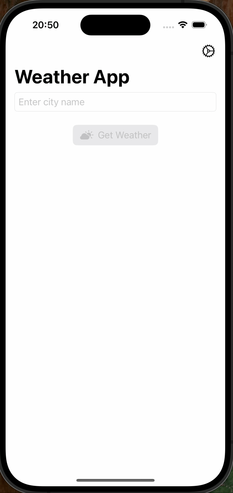

# 🌦️ Weather App (SwiftUI)

A modern and lightweight iOS app that fetches and displays real-time weather for any city using the [WeatherAPI](https://www.weatherapi.com/) service.  
Built with **SwiftUI**, **async/await**, and a clean **MVVM** architecture.

 

## Demo
<a href="./assets/demo.gif">
  
</a>

---

## ✨ Features

- 🔎 Search weather by **city name**
- 🌡️ Toggle between **Celsius** and **Fahrenheit** (saved via `@AppStorage`)
- 🖼️ Dynamic weather icons using `AsyncImage`
- ⚡ Fast, responsive UI built with **SwiftUI**
- ❗ Friendly error handling
- 🧱 Well-structured **MVVM** design

---

## 🧰 Tech Stack

| Category | Technology |
|-----------|-------------|
| **Language** | Swift |
| **Framework** | SwiftUI |
| **Architecture** | MVVM |
| **Networking** | URLSession + Codable |
| **Concurrency** | async/await |
| **Minimum iOS** | 18.5 |
| **IDE** | Xcode 16+ |

---

## 📖 Table of Contents

- [Getting Started](#getting-started)
- [Usage](#usage)
- [Project Structure](#project-structure)
- [Configuration & Secrets](#configuration--secrets)
- [.gitignore for Secrets](#gitignore-for-secrets)
- [Troubleshooting](#troubleshooting)
- [Roadmap](#roadmap)
- [Acknowledgments](#acknowledgments)
- [Maintainer](#maintainer)

---

## 🚀 Getting Started

### 1️⃣ Clone the Repository

```bash
git clone "https://github.com/HamedKharazmi1990/WeatherApp"
cd "Weather App"

### 2️⃣ Create Your Weather API Key
Get a free API key from WeatherAPI.

Create a file called Secrets.plist in:

swift
Copy code
Weather App/Weather App/Config/Secrets.plist
Paste the following content (replace YOUR_WEATHERAPI_KEY):

xml
Copy code
<?xml version="1.0" encoding="UTF-8"?>
<!DOCTYPE plist PUBLIC "-//Apple//DTD PLIST 1.0//EN" "http://www.apple.com/DTDs/PropertyList-1.0.dtd">
<plist version="1.0">
<dict>
    <key>API_KEY</key>
    <string>YOUR_WEATHERAPI_KEY</string>
</dict>
</plist>
⚠️ Do not commit your real API key. See .gitignore for Secrets.

### 3️⃣ Open & Run
Open Weather App/Weather App.xcodeproj in Xcode 16+

Choose an iOS 18.5+ simulator

Press Run (⌘R)

### 💡 Usage
Enter a city name (e.g., Berlin, New York, Tehran).

Tap Search to view live weather.

Use the gear icon to switch between Celsius and Fahrenheit.

### 🧩 Project Structure
graphql
Copy code
Weather App
├── Assets.xcassets
├── Config
│   └── Secrets.plist         # Your API key (ignored in git)
├── Models
│   └── WeatherResponse.swift # Codable models for API response
├── ViewModels
│   ├── WeatherError.swift    # User-friendly error messages
│   └── WeatherViewModel.swift# Async fetch + state handling
├── Views
│   ├── ErrorMessageView.swift
│   ├── WeatherCard.swift     # Weather snapshot component
│   └── WeatherView.swift     # Main search and display UI
├── Weather_App.entitlements
└── Weather_AppApp.swift      # App entry point
### 🔄 Data Flow
scss
Copy code
WeatherView
   ↓ triggers
WeatherViewModel.search()
   ↓ fetches
WeatherAPI → Decodes → WeatherResponse
   ↓ updates
WeatherCard + ErrorMessageView
API Request Example:

pgsql
Copy code
https://api.weatherapi.com/v1/current.json?key=<API_KEY>&q=<CITY>&aqi=no
### ⚙️ Configuration & Secrets
The app securely reads the API key from Config/Secrets.plist using:

swift
Copy code
Bundle.main.url(forResource: "Secrets", withExtension: "plist")
Do not hardcode keys directly in your source files.

🧾 .gitignore for Secrets
Add the following rules to your .gitignore:

perl
Copy code
# macOS
.DS_Store

# Xcode user data
*.xcuserstate
*.xcuserdatad

# Secrets
**/Config/Secrets.plist
🧰 Troubleshooting
Problem    Possible Fix
401/403 Unauthorized    Check your WeatherAPI key and free plan limits
Decoding Error    Verify your API response or key
No Results Found    Try a more common city name

### 🗺️ Roadmap
🌍 Auto-detect location using CoreLocation

🕒 Add hourly and daily forecast

🌓 Improve dark mode UI

🗂️ Save favorite cities

🧪 Add unit & snapshot tests

🙏 Acknowledgments
WeatherAPI — for providing free weather data and icons.


### 👨‍💻 Maintainer
Hamed Kharazmi
📧 hamed.kharazmi@gmail.com

PRs and suggestions are always welcome!
